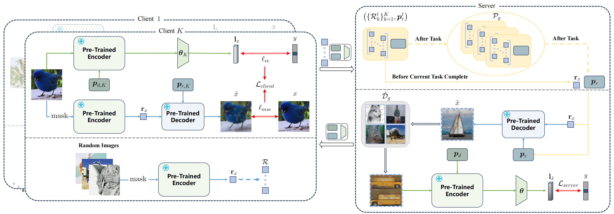

# Masked Autoencoders are Parameter-Efficient Federated Continual Learners

<p align="center">
  
</p>

## 1. Introduction

This repository contains the official source code for the paper Masked Autoencoders are Parameter-Efficient Federated Continual Learners.

## Requirements

To ensure smooth execution of the code, we recommend setting up a dedicated environment using `conda`.

### Steps:

1. First, make sure you have [Anaconda](https://www.anaconda.com/products/distribution) or [Miniconda](https://docs.conda.io/en/latest/miniconda.html) installed.

2. Create a new conda environment:

    ```bash
    conda create -n pMAE python==3.9.18
    ```

3. Activate the environment:

    ```bash
    conda activate pMAE
    ```

4. Install the required packages:

    ```bash
    pip install -r requirements.txt
    ```

## Datasets

ImageNet-R and CUB-200 dataset can be downloaded from the link provided in [LAMDA-PILOT](https://github.com/sun-hailong/LAMDA-PILOT). Please specify the folder of your dataset in `src/utils/conf.py`.

## Checkpoints
Please download pre-trained MAE models from [Sup](https://drive.google.com/file/d/1pkykLQgnvguDzqPnaA-CGwi7P-GESZWE/view?usp=sharing) and [iBOT](https://drive.google.com/file/d/1IjJQ1yAtqsjyj6Zz1IEM86a75Ddij-op/view?usp=sharing) and then put the pre-trained models to the folder specified in `src/utils/conf.py`.

## Experiments

Set the `[DATASET]` and `[MODEL]` options using the filenames of the .json files in the configs folder. If the selected model includes pMAE, set the `[METHOD]` to pmae; otherwise, set it to fedavg.

```bash
python src/main_fcl.py --dataset [DATASET] --model [MODEL] --method [METHOD] --device 0
```

### Examples:

```bash
python src/main_fcl.py --dataset cub_T20_beta5e-1 --model sup_pmae --method pmae --device 0
```

---

```bash
python src/main_fcl.py --dataset cub_T20_beta5e-1 --model sup_coda_prompt --method fedavg --device 0
```

---

```bash
python src/main_fcl.py --dataset cub_T20_beta5e-1 --model sup_coda_prompt_w_pmae --method pmae --device 0
```

## Acknowledgments

This repo is heavily based on [LAMDA-PILOT](https://github.com/sun-hailong/LAMDA-PILOT), [MarsFL](https://github.com/WenkeHuang/MarsFL), and [mae](https://github.com/facebookresearch/mae), many thanks.
